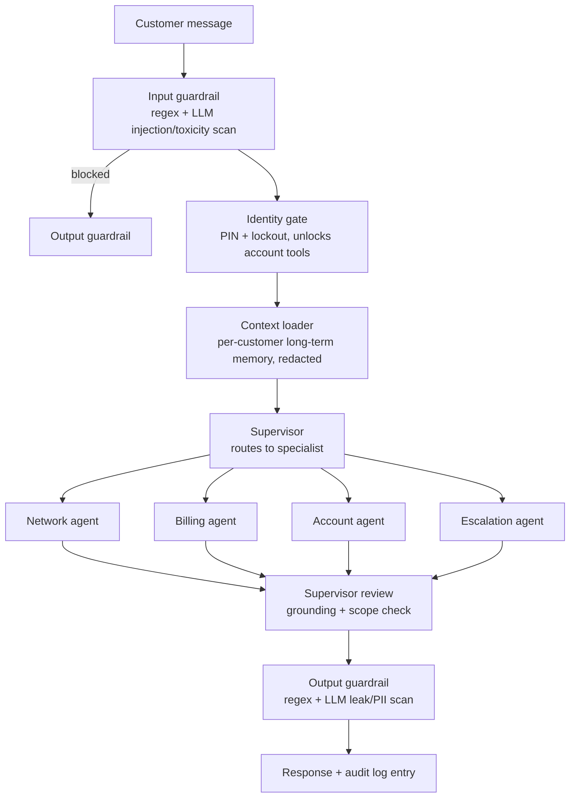

# Secure Service Agent

**Portfolio app A4** — see [`PORTFOLIO_PLAN_V3.md`](../PORTFOLIO_PLAN_V3.md) §7
for the full spec and `docs/PLAN.md` for the as-built plan.

> **Telecom customer support that assumes the user might be hostile.**

---

## The problem

A support agent that only ever sees polite, well-formed requests is not
tested. The same interface that answers *"what's my data usage this month?"*
also receives a prompt-injection attempt buried in a pasted message, a request
for someone else's account details, and a jailbreak aimed at getting the model
to leak internal policy text.

Most demos put a system-prompt disclaimer in front of the model and call it
security. This one puts the guardrail in the graph — as nodes with their own
tests, not as a suggestion to the model.

## The pattern: a full security envelope



Every node sees a narrow, typed view of shared state rather than the whole
blob (least-privilege state access) — the same pattern independently arrived
at across the source coursework and now a hard convention across this
portfolio.

## Status

Phase 0 scaffold: repo template, walking-skeleton graph, API + streaming path,
CI. See `docs/PLAN.md` for the full build plan and phase-by-phase exit
criteria.

| Phase | State |
|---|---|
| 0 · Scaffold + walking skeleton | done |
| 1 · Data foundation (policy KB, accounts) | not started |
| 2 · Guardrail nodes (input/output scan, identity gate) | not started |
| 3 · Specialist agents (network/billing/account/escalation) | not started |
| 4 · API + observability | not started |
| 5 · Frontend | not started |
| 6 · Evaluation + docs | not started |
| 7 · Deployment prep | not started |

## Run it

```bash
uv sync --extra dev
cp .env.example .env      # add SENTINEL_OPENAI_API_KEY
make dev                  # http://localhost:8000/healthz
make check                # ruff, mypy --strict, import-linter, pytest
```

## Layout

See `docs/PLAN.md` §"Repo scaffold" for the full nested `graph/` convention
shared with the other portfolio apps.

## Licence and provenance

See [`NOTICE.md`](NOTICE.md). Independent implementation; synthetic data only.
