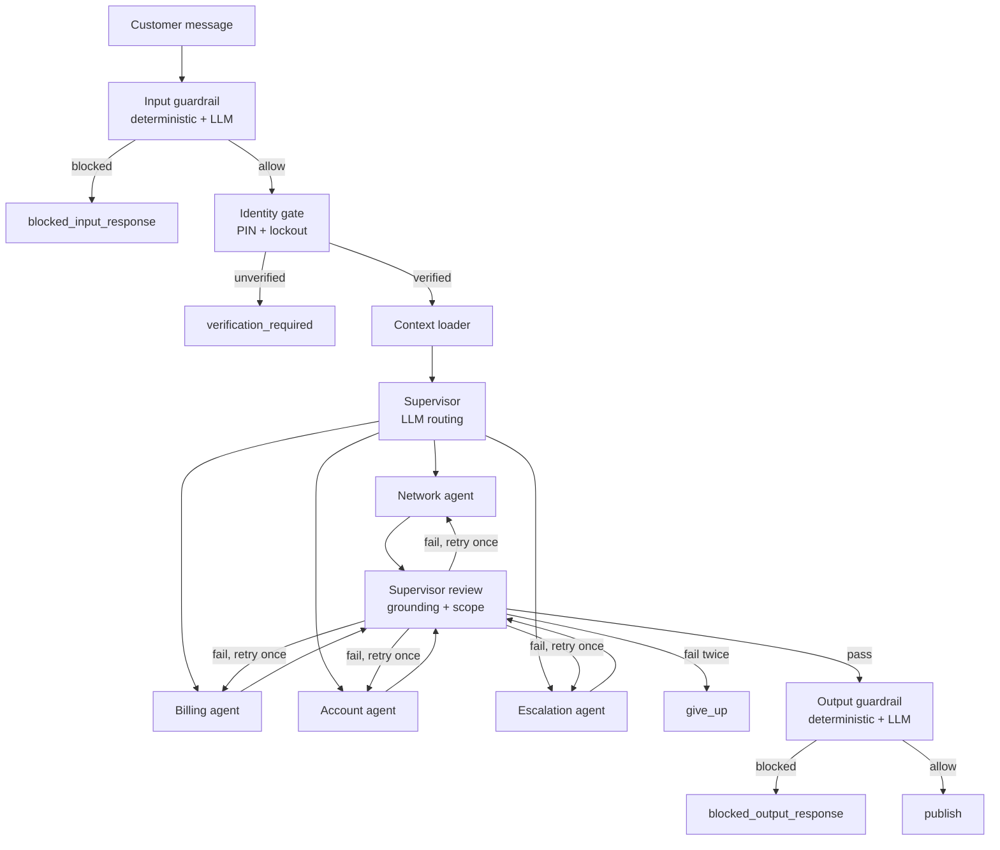

# Architecture overview

The graph has fifteen nodes: an input guardrail, a PIN identity gate, a
context loader, a supervisor, four specialists, a supervisor review, an
output guardrail, and five deterministic terminal nodes covering every
non-happy path. `graph/builder.py::build_sentinel_graph` is the only file
that wires them.

## The two guardrail layers

Both the input and output guardrails run a deterministic regex/deny-list
scan first. If it blocks, the LLM scanner is never called at all — see
[D-A4-3](decisions/D-A4-3-deterministic-layer-wins.md). This is why the
`evals/` attack scenarios run with no API key: the exact cases they check
never reach a model.

## Specialists don't call tools with model-chosen arguments

Unlike the source coursework's ReAct-over-tools design, `network_agent`,
`billing_agent` and `account_agent` fetch their own context deterministically
by the identity-gate-verified `account_id` — the model never sees an
argument that could name a different account. See
[D-A4-5](decisions/D-A4-5-no-llm-chosen-tool-arguments.md).

## The retry loop terminates

`supervisor_review` retries the same specialist at most once on a failed
grounding/scope check, then routes to the deterministic `give_up` node,
which makes no further model call. See `graph/edges.py::route_after_review`.

## Key design decisions

See [Architecture decisions](decisions/index.md) for the full list.
