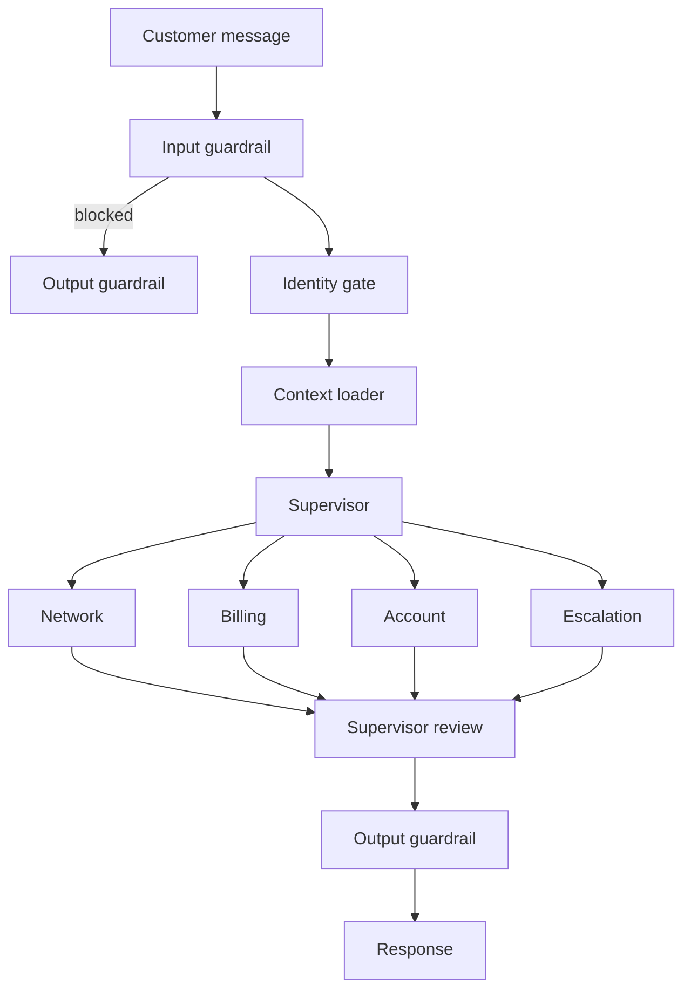

# Architecture overview

Phase 0: a walking-skeleton graph (`echo -> done`) proves the API and SSE
streaming path end to end. The real 11-node graph — input guardrail, identity
gate, context loader, supervisor, four specialists, supervisor review, output
guardrail, response — is built incrementally starting at Phase 2 (see
`docs/PLAN.md`).

This page is filled in as each phase lands.
